# Advent of Code 2025

Solutions for Advent of Code 2025 challenges, written in Rust with benchmarking support.

## 📋 Prerequisites

- Rust toolchain
- [hyperfine](https://github.com/sharkdp/hyperfine) for benchmarking

## 🚀 Quick Start

### Setting Up a Day

Create your solution files:
   - `src/bin/p1.rs` for Part 1
   - `src/bin/p2.rs` for Part 2

### Running Benchmarks

From the project root, run:

```bash
./bench.sh <day_folder>
```

For example:
```bash
./bench.sh day2
```

This will:
- Build the release binaries
- Run hyperfine benchmarks on both `p1` and `p2` binaries
- Generate a `benchmarks.md` file in the day's directory with performance results
- Use 15 warmup runs before measuring

## 📁 Project Structure

```
advent_2025/
├── day1/          # Day 1 solution
├── day2/          # Day 2 solution
├── day3/          # Day 3 solution
├── bench.sh       # Benchmarking script
└── benchmarks.md  # Overall benchmark results
```

Each day directory contains:
- `src/bin/p1.rs` - Part 1 solution
- `src/bin/p2.rs` - Part 2 solution
- `input.txt` - Puzzle input (hidden)
- `test.txt` - Test input (if applicable)
- `benchmarks.md` - Performance benchmarks for that day

## 📊 Benchmarking

The benchmarking script uses [hyperfine](https://github.com/sharkdp/hyperfine) to measure execution time. Results are saved as markdown tables in each day's `benchmarks.md` file.

### Benchmark Results

```mermaid
xychart-beta
    title "Advent of Code 2025 - Benchmark Results"
    x-axis "Day" [2, 4, 5, 6, 7, 8, 9, 10, 12]
    y-axis "Time (ms)" 0 --> 70
    bar "Part 1" [2.3, 1.3, 1.0, 1.2, 1.2, 15.1, 1.2, 17.6, 1.4]
    bar "Part 2" [68.4, 2.6, 0.9, 1.1, 1.1, 15.2, 11.5, 9.3, 0]
```




